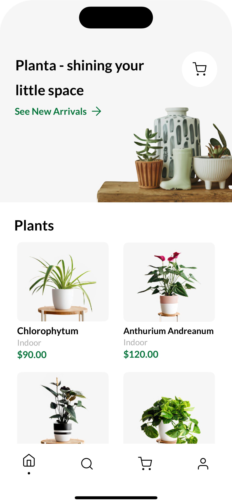
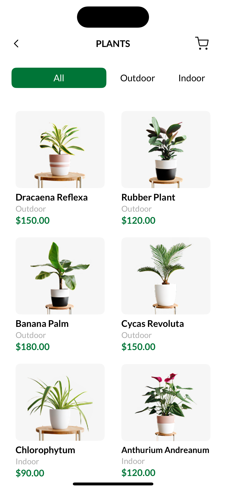
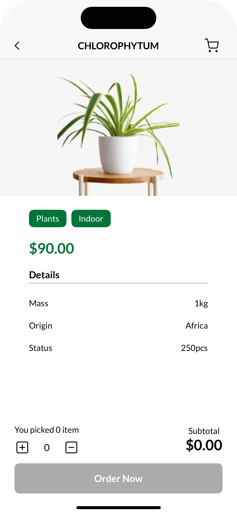
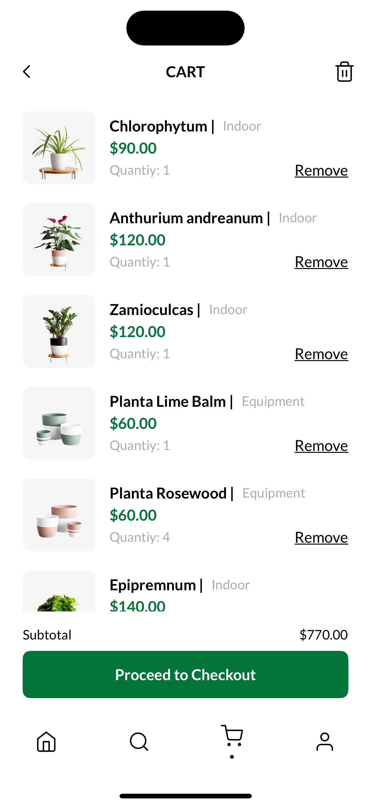

# 🌿 Planta
Planta is a modern iOS application for buying flowers and gardening tools online. The app offers a user-friendly interface, fast product search, and a simple checkout experience.

## 🛠️ Tech Stack
Swift | SwiftUI | SwiftConcurrency | MVVM | IOS18

## 📱 Features
<details>
  <summary> Details (Click to expand) </summary>
  <br>

  - 🔐 Email authentication
  - 🔎 Product search by name
  - 🛒 Add products to cart
  - 🧾 View order history
  - 🌸 Product detail view with photos and descriptions
</details>

## 🗂 Project Structure
<details>
  <summary> Details (Click to expand) </summary>
  <br>

```bash
  Planta/
├── Core/             # Core service: caching, validation
├── Extensions/       # Type extensions, formatters & helpers
├── Features/         # Business modules
├── Resources/        # App assets: images, icon & colors
├── Supporting/       # App entry point
└── UI/               # Reusable UI components

  PlantaTests/        # Unit tests
```
</details>

## 🖼 Screens
<details>
  <summary> Details (Click to expand) </summary>
  <br>

  |  |  |  |
  |-------------------|-------------------|-------------------|
  |  |  |
</details>

## 🚀 Getting Started
<details>
  <summary> Details (Click to expand) </summary>
  <br>

  1. Clone the repository:

  ```bash
    git clone https://github.com/PlantaApp/planta.git
  ```
    
  3. Open Planta.xcodeproj or Planta.xcworkspace in Xcode.
  4. Select your target device or simulator.
  5. Press ⌘ + R to build and run the app.
</details>

## 🔧 Dependencies
<details>
  <summary> Details (Click to expand) </summary>
  <br>

  [SwiftfulRouting](https://github.com/SwiftfulThinking/SwiftfulRouting) — for convenient and structured navigation in SwiftUI
</details>

## 🤝 Contact
If you have questions, feature suggestions, or want to report bugs, feel free to open an issue or contact me directly.

## 🔖 License
This project is licensed under the MIT License.
